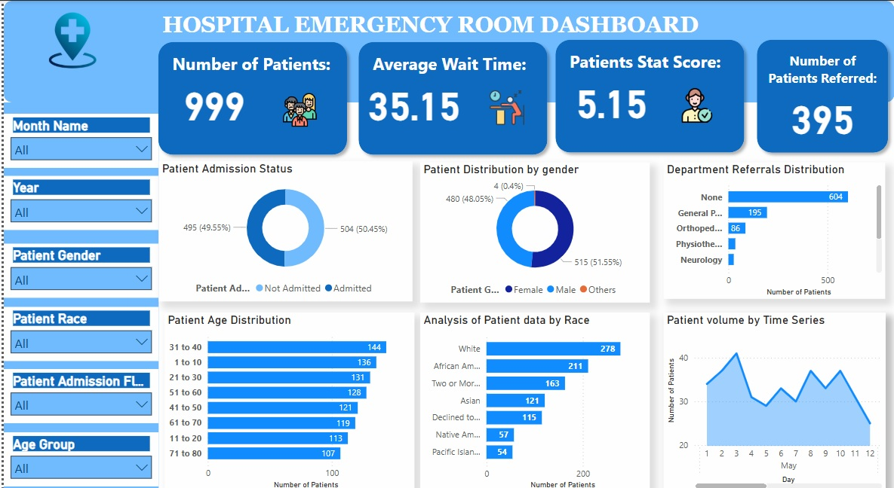

# HospitalEM
Monitor key metrics and trends on a month-by-month basis to identify patterns and areas for  improvement.

## Problem Statement 
- Dashboard 1: Monthly View

## Charts to Develop:
 • Patient Admission Status: Track admitted vs. non-admitted patients.

 • Patient Age Distribution: Group patients by 10-year age intervals.

 • Department Referrals: Analyze referral trends across different departments.

 • Timeliness: Measure the percentage of patients seen within 30 minutes.

 • Gender Analysis: Visualize patient distribution by gender.

 • Racial Demographics: Analyze patient data by race.

 • Time Analysis: Assess patient volume by day and hour

## Visualisation 

## Patient Admission Summary
Admission Status:

Not Admitted cases totaled 504, slightly higher than Admitted cases at 495.

Not Admitted represented 50.45% of all patient admission outcomes.

## Patient Distribution by Age Group
The age group 31–40 had the highest patient count at 144, which is 34.58% higher than the 71–80 age group, which had the lowest count at 107.

Patients aged 31–40 accounted for 14.41% of the total patient population.

Across all 8 age groups, patient counts ranged from 107 to 144.

## Patient Distribution by Race
The White demographic had the highest number of patients at 278, which is 414.81% more than Pacific Islanders, the group with the lowest count at 54.

White patients represented 27.83% of the total.

Patient counts across all 7 racial groups ranged from 54 to 278.

## Patient Distribution by Department Referral
Patients referred from the None department were the highest at 604, while Renal had the lowest at 9, marking a 6,611.11% difference.

The None category accounted for 60.46% of all referrals.

Across all 8 referral departments, patient counts ranged from 9 to 604.

## Patient Gender Distribution
Female patients had the highest count at 515, followed by Male at 480, and Others at 4.

Female patients represented 51.55% of the total gender distribution.
